# Fullsend Architecture Diagrams

Official Mermaid diagrams for the Fullsend GTM Agent system architecture.

---

## System Layer Overview

```mermaid
flowchart TB
    subgraph human["🧑 HUMAN LAYER"]
        Users[Discord Users]
        Bot[Discord Bot]
        Dashboard[Web Dashboard]
    end

    subgraph gateway["🚪 GATEWAY LAYER"]
        Discord[Discord Service<br/><i>Python daemon</i>]
    end

    subgraph filter["🔍 FILTER LAYER"]
        Watcher[Watcher<br/><i>Gemini Flash</i>]
    end

    subgraph brain["🧠 BRAIN LAYER"]
        Orchestrator[Orchestrator<br/><i>Claude Opus + thinking</i>]
        FULLSEND[FULLSEND Agent<br/><i>Claude Code</i>]
        Builder[Builder Agent<br/><i>Claude Code</i>]
        Roundtable[Roundtable<br/><i>Multi-agent debate</i>]
    end

    subgraph execution["⚙️ EXECUTION LAYER"]
        Executor[Executor<br/><i>Worker pool</i>]
        ToolRegistry[Tool Registry<br/><i>Redis keys</i>]
    end

    subgraph monitoring["📊 MONITORING LAYER"]
        RedisAgent[Redis Agent<br/><i>Gemini Flash</i>]
    end

    subgraph infra["💾 INFRASTRUCTURE"]
        Redis[(Redis<br/>Pub/Sub + Keys)]
    end

    Users <--> Bot
    Bot <--> Dashboard
    Bot <--> Discord
    Dashboard <--> Discord
    
    Discord <--> Watcher
    Watcher <--> Orchestrator
    
    Orchestrator --> FULLSEND
    Orchestrator --> Builder
    Orchestrator --> Roundtable
    FULLSEND --> Builder
    
    FULLSEND --> Executor
    Builder --> ToolRegistry
    Executor <--> ToolRegistry
    
    Executor --> RedisAgent
    RedisAgent --> Orchestrator
    
    Discord <--> Redis
    Watcher <--> Redis
    Orchestrator <--> Redis
    FULLSEND <--> Redis
    Builder <--> Redis
    Executor <--> Redis
    RedisAgent <--> Redis
```

---

## Redis Pub/Sub Channel Flow

---

## Detailed Pub/Sub Wiring

---

## Message Flow Patterns

### Simple Question (Watcher Handles)

### Strategic Question (Orchestrator Handles)

### Full Experiment Loop

### Error Recovery Flow

---

## Experiment Lifecycle State Machine

---

## Tool Lifecycle State Machine

---

## Service Startup Modes

---

## Component Summary

| # | Component | Runtime | Model | Role |
|---|-----------|---------|-------|------|
| 1 | Discord Service | Python daemon | None | Front door — bot + dashboard |
| 2 | Watcher | API agent | Gemini Flash | Receptionist — filters noise |
| 3 | Orchestrator | Python daemon | Claude Opus (thinking) | Manager — context-rich decisions |
| 4 | FULLSEND Listener | Python daemon | None | Bridge — Redis → Claude Code |
| 5 | FULLSEND Agent | Claude Code | Claude Sonnet/Opus | Brain — designs experiments |
| 6 | Builder Listener | Python daemon | None | Bridge — Redis → Claude Code |
| 7 | Builder Agent | Claude Code | Claude Sonnet/Opus | Constructor — builds tools |
| 8 | Executor | Worker pool | None | Runner — executes experiments |
| 9 | Redis Agent | API agent | Gemini Flash | Analyst — monitors metrics |
| 10 | Redis | Infrastructure | N/A | Memory — pub/sub + state |
| 11 | Roundtable | Python script | Mixed | Council — AI debate for ideas |

---

## Channel Reference

| Channel | Purpose | Publishers | Subscribers |
|---------|---------|------------|-------------|
| `fullsend:discord_raw` | Raw Discord messages | Discord | Watcher |
| `fullsend:to_orchestrator` | Escalations, alerts | Watcher, Redis Agent, FULLSEND, Builder | Orchestrator |
| `fullsend:from_orchestrator` | Responses to Discord | Orchestrator, Watcher | Discord |
| `fullsend:to_fullsend` | Experiment requests | Orchestrator | FULLSEND Listener |
| `fullsend:builder_tasks` | Tool PRDs | Orchestrator, FULLSEND | Builder Listener |
| `fullsend:builder_results` | Build completions | Builder | FULLSEND Listener |
| `fullsend:execute_now` | Trigger execution | FULLSEND | Executor |
| `fullsend:experiment_results` | Run outcomes | Executor | FULLSEND Listener |
| `fullsend:metrics` | Real-time metrics | Executor | Redis Agent |
| `fullsend:schedules` | Schedule updates | FULLSEND | Executor |
