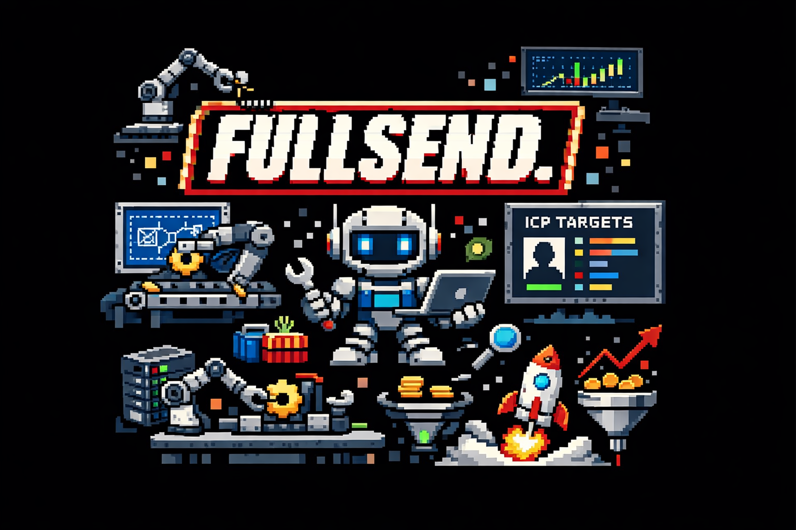
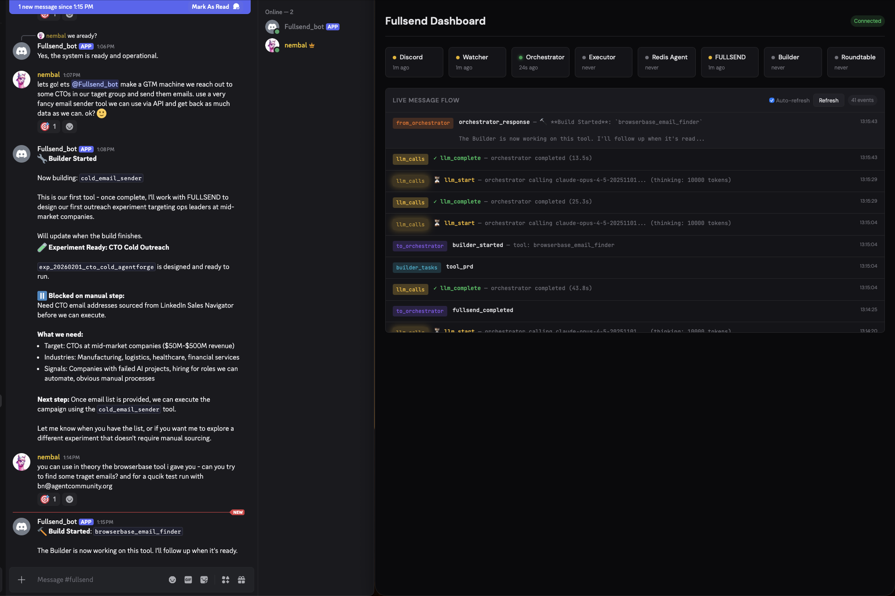

<p align="center">
  
</p>

# Fullsend

An autonomous GTM agent that ships ideas continuously, builds its own tools, and gets smarter over time.


*The Fullsend dashboard showing Discord integration and live message flow between services*

See [VISION.md](./VISION.md) for the full concept and architecture.

---

## The Agent That Builds Its Own Sales Pipeline

Here's something wild that happened: **Fullsend autonomously designed and built an entire hiring-signal outreach pipeline** — from scratch, without human intervention.

### What the Agent Did

The Orchestrator received a strategic goal: *"Find companies actively hiring for roles that suggest they need AI/automation help, and reach out to decision-makers."*

Here's what happened next:

**1. The Agent Identified a Gap**

Fullsend realized it didn't have a tool to find companies with active job postings. Instead of asking for help, it dispatched a request to the **Builder** service with a detailed PRD.

**2. Builder Created the Tool**

The Builder agent (powered by Claude Code) autonomously wrote `job_posting_finder.py` — a complete tool that:
- Scrapes job boards for relevant postings
- Extracts company names, roles, and hiring signals
- Scores companies based on ICP fit (team size, funding stage, tech stack)
- Returns structured data ready for outreach

**3. FULLSEND Designed the Experiment**

With the new tool available, the FULLSEND agent designed a multi-phase pipeline:

```yaml
phases:
  - phase: 1_discover_companies
    tool: job_posting_finder
    # Find companies hiring for ops/automation roles
    
  - phase: 2_find_contacts  
    tool: browserbase_email_finder
    # Get HR/hiring manager emails
    
  - phase: 3_personalized_outreach
    tool: cold_email_sender
    # Send tailored pitches based on their job postings
```

**4. Scheduled for Autonomous Execution**

The experiment was registered with a cron schedule: `0 9 * * MON` — every Monday at 9 AM, the pipeline runs automatically, finding fresh hiring signals and reaching out to new prospects.

### The Compound Effect

This is the Fullsend loop in action:

```
Idea → Build Tool → Design Experiment → Execute → Learn → Repeat
```

The agent doesn't just run campaigns — it **builds the infrastructure** to run campaigns. Each tool it creates becomes available for future experiments. Each experiment generates learnings that inform the next strategy.

**No human wrote the job posting scraper. No human designed the outreach sequence. The agent identified the need, built the solution, and deployed it.**

This is what autonomous GTM looks like.

---

## Quick Start

```bash
# Install uv (if not already installed)
curl -LsSf https://astral.sh/uv/install.sh | sh

# Clone and setup
git clone <repo-url>
cd fullsend
uv sync

# Configure
cp .env.example .env
# Edit .env with your API keys (Discord, Anthropic, Google, etc.)

# Define your product
# Edit context/product_context.md with what you're selling

# Run everything
./run_all.sh

# Open dashboard
open http://127.0.0.1:8050/
```

### Fresh Start / New Product

```bash
# Reset everything and start fresh
./restart.sh

# Or keep product context, reset agent state
./restart.sh --soft
```

## Project Structure

```
fullsend/
├── services/
│   ├── discord/       # Discord bot + Web dashboard
│   ├── watcher/       # Message classifier (Gemini)
│   ├── orchestrator/  # Strategic brain (Claude)
│   ├── executor/      # Runs experiments
│   ├── fullsend/      # Experiment designer (Claude Code)
│   ├── builder/       # Tool builder (Claude Code)
│   └── redis_agent/   # Metrics monitor
├── tools/             # Agent-built tools live here
├── context/           # Product context, learnings, worklist
└── demo/dashboard/    # Real-time visualization
```

## Services

### Discord (`services/discord/`)

Communication interface - Discord bot + web dashboard that connects humans to the agent.

```bash
# Run Discord bot only
ENV=discord uv run python -m services.discord.main

# Run web dashboard only
ENV=web uv run python -m services.discord.main

# Run both
ENV=both uv run python -m services.discord.main
```

**Features:**
- Slash commands: `/status`, `/pause`, `/go`, `/idea`, `/focus`, `/learn`, `/wtf`
- Ambient listening in configured channels
- Emoji reactions on captured ideas
- Action requests with human-in-the-loop
- Real-time web dashboard at `http://localhost:8000`

## Development

```bash
# Install all dependencies
uv sync

# Add a dependency to a service
uv add <package> --package fullsend-discord

# Run tests
uv run pytest

# Lint
uv run ruff check .
```

## Requirements

- Python 3.11+
- Redis (for pub/sub between services)
- Discord bot token (create at discord.com/developers)
