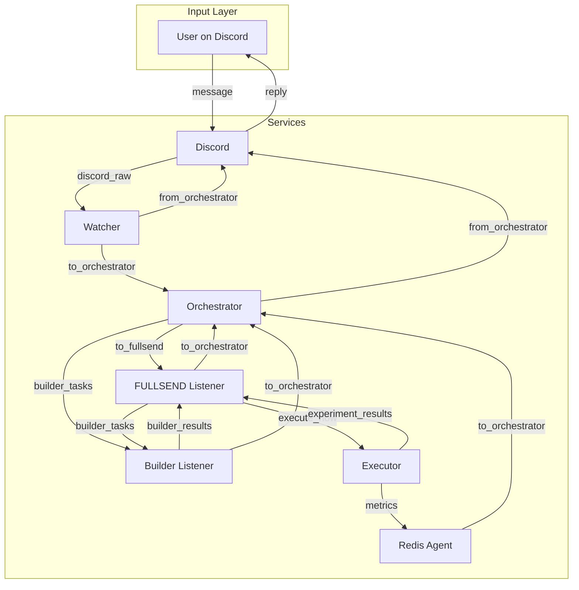

# FULLSEND SYSTEM — Complete Component Guide

Every component in the Fullsend autonomous GTM agent system.

---

## Overview

Fullsend is a self-building GTM machine. It doesn't come with scrapers, enrichers, or email senders pre-built. It comes with the ability to **build those things itself** when it needs them. The system runs multiple concurrent experiments, learns from results, scales winners, kills losers, and continuously improves.

**Architecture:** Containerized microservices, all communicating through Redis (pub/sub + persistent keys).

---

## Component Summary

| # | Component | Runtime | Model | Role | Status |
|---|-----------|---------|-------|------|--------|
| 1 | Discord Service | Python daemon | None | Front door — bot + dashboard | ✅ Built & Reviewed |
| 2 | Watcher | API agent | Gemini 2.0 Flash | Receptionist — filters noise | ✅ Built & Reviewed (70 tests) |
| 3 | Orchestrator | Python daemon | Claude Opus 4 (thinking) | Manager — context-rich decision maker | ✅ Built & Reviewed (104 tests) |
| 4 | FULLSEND Listener | Python daemon | None | Bridge — Redis → Claude Code | ✅ Built & Wired |
| 5 | FULLSEND Agent | Claude Code instance | Claude Sonnet/Opus via CLI | The brain — designs experiments + metrics | ✅ Built |
| 6 | Builder Listener | Python daemon | None | Bridge — Redis → Claude Code | ✅ Built & Wired |
| 7 | Builder Agent | Claude Code instance | Claude Sonnet/Opus via CLI | Constructor — builds tools/skills from PRDs | ✅ Built |
| 8 | Executor | Worker pool | None (runs tools) | Runner — executes scheduled experiments | ✅ Built & Reviewed (64 tests) |
| 9 | Redis Agent | API agent | Gemini 2.0 Flash | Analyst — monitors metrics, surfaces insights | ✅ Built & Reviewed |
| 10 | Redis | Infrastructure | N/A | Memory — pub/sub + persistent state | ✅ Configured |
| 11 | Roundtable | Python script | Mixed | Creative council — AI debate for ideas | ✅ Built & Reviewed (24 tests) |
| 12 | Moltbook | Integration | N/A | Crowd wisdom — external idea source | To integrate |
| 13 | Browserbase Tool | Python module | N/A | Web scraping via Browserbase API | ✅ Built |

---

## Architecture Diagram

```
┌─────────────────────────────────────────────────────────────────────────────┐
│                              HUMAN LAYER                                     │
│  Discord Users  ←→  Discord Bot  ←→  Web Dashboard                          │
└─────────────────────────────────────────────────────────────────────────────┘
                                    ↓ ↑
┌─────────────────────────────────────────────────────────────────────────────┐
│                           DISCORD SERVICE                                    │
│  • Slash commands  • Reactions  • Status posts  • Action requests           │
└─────────────────────────────────────────────────────────────────────────────┘
                                    ↓ ↑
┌─────────────────────────────────────────────────────────────────────────────┐
│                              WATCHER                                         │
│  • Filters noise  • Answers simple queries  • Escalates important stuff     │
└─────────────────────────────────────────────────────────────────────────────┘
                                    ↓ ↑
┌─────────────────────────────────────────────────────────────────────────────┐
│                        ══ REDIS BUS ══                                       │
│  Channels: to_orchestrator | from_orchestrator | to_fullsend | builder_tasks │
│  Keys: experiments:* | tools:* | learnings:* | hypotheses:* | schedules:*   │
└─────────────────────────────────────────────────────────────────────────────┘
           ↓ ↑                    ↓ ↑                    ↓ ↑
┌──────────────────┐    ┌──────────────────┐    ┌──────────────────┐
│   ORCHESTRATOR   │    │ FULLSEND LISTENER│    │ BUILDER LISTENER │
│                  │    │   [Python]       │    │   [Python]       │
│ • Reads context  │───→│ • Subscribes to  │    │ • Subscribes to  │
│ • Prioritizes    │    │   to_fullsend    │    │   builder_tasks  │
│ • Dispatches     │    │ • Writes file    │    │ • Writes PRD     │
│ • Initiates      │    │ • Spawns Claude  │    │ • Spawns Claude  │
│   Roundtable     │    │ • Reports back   │    │ • Reports back   │
│ [Thinking Model] │    └────────┬─────────┘    └────────┬─────────┘
└──────────────────┘             ↓                       ↓
           ↑            ┌──────────────────┐    ┌──────────────────┐
           │            │  FULLSEND AGENT  │    │  BUILDER AGENT   │
           │            │  [Claude Code]   │    │  [Claude Code]   │
           │            │ • Designs experi-│───→│ • Receives PRDs  │
           │            │   ments + metrics│    │ • Builds tools   │
           │            │ • Sets schedules │    │ • Tests & commits│
           │            │ • RALPH loops    │    │ • Registers tools│
           │            └──────────────────┘    └──────────────────┘
           │                                              │
           │                                              ↓
┌──────────────────┐    ┌──────────────────┐    ┌──────────────────┐
│   REDIS AGENT    │    │     EXECUTOR     │    │  TOOL REGISTRY   │
│                  │    │                  │    │                  │
│ • Watches metrics│←───│ • Cron-triggered │←───│ • Skills catalog │
│   defined by     │    │ • Runs scheduled │    │ • Code pointers  │
│   FULLSEND       │    │   experiments    │    │ • Usage stats    │
│ • Surfaces       │    │ • Reports results│    │ • Dependencies   │
│   insights       │    │                  │    │                  │
│ [API Agent]      │    │ [Worker Pool]    │    │ [Redis Keys]     │
└──────────────────┘    └──────────────────┘    └──────────────────┘
           │
           ↓
┌──────────────────┐    ┌──────────────────┐
│    ROUNDTABLE    │    │     MOLTBOOK     │
│                  │    │                  │
│ • Multi-agent    │    │ • External crowd │
│   debate         │    │   ideas          │
│ • Idea generation│    │ • Human-in-loop  │
│ • Seeded with    │    │                  │
│   learnings      │    │                  │
└──────────────────┘    └──────────────────┘
```

---

## Redis Pub/Sub Wiring

Complete mapping of which services publish/subscribe to which channels.

### Channel Flow Diagram



### Pub/Sub Matrix

| Service | Subscribes To | Publishes To |
|---------|---------------|--------------|
| **Discord** | `fullsend:from_orchestrator` | `fullsend:discord_raw` |
| **Watcher** | `fullsend:discord_raw` | `fullsend:from_orchestrator` (simple responses), `fullsend:to_orchestrator` (escalations) |
| **Orchestrator** | `fullsend:to_orchestrator` | `fullsend:from_orchestrator`, `fullsend:to_fullsend`, `fullsend:builder_tasks` |
| **FULLSEND Listener** | `fullsend:to_fullsend`, `fullsend:builder_results`, `fullsend:experiment_results` | `fullsend:to_orchestrator`, `fullsend:execute_now`, `fullsend:builder_tasks` |
| **Builder Listener** | `fullsend:builder_tasks` | `fullsend:builder_results`, `fullsend:to_orchestrator` |
| **Executor** | `fullsend:execute_now`, `fullsend:schedules` | `fullsend:metrics`, `fullsend:experiment_results` |
| **Redis Agent** | `fullsend:metrics` | `fullsend:to_orchestrator` (alerts) |

### Channel Reference

| Channel | Purpose | Publishers | Subscribers |
|---------|---------|------------|-------------|
| `fullsend:discord_raw` | Raw Discord messages | Discord | Watcher |
| `fullsend:to_orchestrator` | Escalations, alerts, notifications | Watcher, Redis Agent, FULLSEND, Builder | Orchestrator |
| `fullsend:from_orchestrator` | Responses back to Discord | Orchestrator, Watcher | Discord |
| `fullsend:to_fullsend` | Experiment design requests | Orchestrator | FULLSEND Listener |
| `fullsend:builder_tasks` | Tool PRDs to build | Orchestrator, FULLSEND | Builder Listener |
| `fullsend:builder_results` | Tool build completions | Builder | FULLSEND Listener |
| `fullsend:execute_now` | Trigger experiment execution | FULLSEND | Executor |
| `fullsend:experiment_results` | Execution outcomes | Executor | FULLSEND Listener |
| `fullsend:metrics` | Real-time experiment metrics | Executor | Redis Agent |
| `fullsend:schedules` | Schedule updates | FULLSEND | Executor |

### Message Flow Examples

**Simple Question (Watcher handles):**
```
User → Discord → discord_raw → Watcher → from_orchestrator → Discord → User
```

**Strategic Question (Orchestrator handles):**
```
User → Discord → discord_raw → Watcher → to_orchestrator → Orchestrator → from_orchestrator → Discord → User
```

**Experiment Design (Full loop):**
```
Orchestrator → to_fullsend → FULLSEND → [designs] → execute_now → Executor → metrics → Redis Agent
                                     ↓
                          [needs tool] → builder_tasks → Builder → builder_results → FULLSEND → execute_now
```

**Error Recovery:**
```
Executor → experiment_results [error] → FULLSEND → [ToolNotFound] → builder_tasks → Builder → builder_results → FULLSEND → execute_now → Executor
```

---

## Core Concepts

### Experiments vs Tools (Skills)

**Experiments** = Hypotheses to test
- "Cold email CTOs who starred competitor repos"
- "Sponsor AI hackathon in SF"
- Designed by FULLSEND, include success metrics
- Have lifecycle: designed → scheduled → running → complete → analyzed

**Tools (Skills)** = Capabilities to execute experiments
- "GitHub stargazer scraper"
- "LinkedIn profile enricher"
- "Email sender with tracking"
- Built by Builder, stored in registry
- Reusable across experiments

### The Learning Loop

```
FULLSEND designs experiment
    ↓
    ├── Needs new tool? → Builder creates it
    ↓
FULLSEND sets schedule/triggers
    ↓
Executor runs experiment (cron)
    ↓
Redis Agent monitors metrics (defined by FULLSEND)
    ↓
Results → Orchestrator → FULLSEND
    ↓
FULLSEND learns, designs next experiment
```

---

## 1. DISCORD SERVICE (The Front Door)

**Status:** ✅ Already built

**Container:** `fullsend-discord`

**What it is:** The public interface. Discord bot + web dashboard connecting humans to the agent system.

**Personality:** Dumb but reliable. A messenger, not a thinker. Passes messages faithfully.

**What it does:**
- Listens to configured channels, reacts with 🎯 on ideas
- Handles slash commands (`/status`, `/pause`, `/go`, `/idea`)
- Posts status updates, wins, learnings to status channel
- Manages action requests (human approvals via reactions)
- Bridges everything to/from Redis pub/sub
- Serves web dashboard at localhost:8000

**Redis channels:**
- Publishes to: `fullsend:discord_raw` (raw messages for Watcher to classify)
- Subscribes to: `fullsend:from_orchestrator` (responses from Orchestrator/Watcher)

**When it runs:** Always on (daemon)

---

## 2. WATCHER (The Receptionist)

**Status:** ✅ Built (70 tests passing)

**Container:** `fullsend-watcher`

**Runtime:** API agent (Gemini 2.0 Flash — cheap, fast)

**What it is:** A cheap, fast model monitoring Discord to decide what deserves attention.

**Personality:** Helpful but knows its place. Quick to answer simple stuff, quick to escalate important stuff.

**What it does:**
- Monitors all Discord messages in real-time
- Answers simple status questions without waking Orchestrator
- Marks important messages for Orchestrator to review later
- Summarizes channel activity periodically
- Escalates only when: @mention, urgent situation, explicit request, high-quality idea

**What it doesn't do:** Strategic decisions, dispatch work, design experiments

**Redis channels:**
- Subscribes to: `fullsend:discord_raw`
- Publishes to: `fullsend:to_orchestrator` (escalations only)

**Escalation criteria:**
- Direct @mention of bot
- Keywords: "urgent", "broken", "stop", "help"
- High-quality idea (LLM judgment)
- Explicit command
- Question Watcher can't answer from cache

---

## 3. ORCHESTRATOR (The Manager)

**Status:** ✅ Built (104 tests passing)

**Container:** `fullsend-orchestrator`

**Runtime:** Python daemon with Anthropic API (Opus with extended thinking)

**What it is:** The context-rich decision maker. Doesn't write code, but deeply understands the system state and makes strategic calls.

**Personality:** Thoughtful, strategic, patient. Takes time to understand before acting.

**What it does:**
- Maintains rich context via `worklist.md` and `learnings.md`
- Prioritizes incoming ideas and requests
- Dispatches work to FULLSEND and Builder
- Initiates Roundtable sessions when stuck or exploring
- Decides when to scale up, pause, or kill experiments
- Reports important updates back to Discord
- **Writes strategic learnings** ("event targeting works", "avoid CFOs")

**What it doesn't do:** Write code, run experiments directly, make snap decisions

**Context files (in `context/`):**
- `context/worklist.md` — current priorities, pending ideas, blocked items
- `context/learnings.md` — strategic insights accumulated over time

**Redis interactions:**
- Reads: `experiments:*`, `learnings:tactical:*`, `tools:*`, `hypotheses:*`
- Subscribes to: `fullsend:to_orchestrator`
- Publishes to: `fullsend:from_orchestrator`, `fullsend:to_fullsend`, `fullsend:builder_tasks`

**Key decisions it makes:**
- "This idea is worth testing" → sends to FULLSEND
- "We need a new tool for this" → sends PRD to Builder
- "This experiment is failing" → kills it
- "This is working" → scales it up
- "I'm stuck" → initiates Roundtable
- "We learned something" → writes to `learnings.md`

---

## 4. FULLSEND (The Brain)

**Status:** ✅ Built

**Container:** `fullsend-brain`

**Runtime:** Claude Code instance (not a wrapper)

**What it is:** The creative strategist. Designs experiments, defines success metrics, sets schedules. Has access to skills (Claude Code tools) it can use or expand.

**Personality:** Bold, creative, experimental. Commits fully to ideas. Learns fast.

**What it does:**
- Receives experiment requests from Orchestrator
- Designs complete experiment specifications:
  - Hypothesis
  - Target audience
  - Outreach approach
  - **Metrics to track** (what Redis Agent monitors)
  - Success/failure criteria
  - Schedule/cadence
- Sets cron triggers for Executor
- Can run simple experiments directly (has Claude Code tools)
- Requests new tools from Builder when needed

**Experiment spec (what FULLSEND outputs):**
```yaml
experiment:
  id: exp_20240115_github_stars
  hypothesis: "CTOs who starred competitor repos are high-intent"

  execution:
    tool: github_stargazer_scraper
    params:
      repo: "competitor/product"
      limit: 500
    schedule: "0 9 * * MON"  # Every Monday 9am

  metrics:  # Redis Agent will monitor these
    - name: emails_sent
      type: counter
    - name: response_rate
      type: percentage
      success_threshold: 0.15
    - name: meeting_booked
      type: counter

  success_criteria:
    - response_rate > 0.10
    - meeting_booked >= 3

  failure_criteria:
    - response_rate < 0.02 after 100 sends
    - unsubscribe_rate > 0.05
```

**Redis interactions:**
- Subscribes to: `fullsend:to_fullsend`
- Publishes to: `fullsend:experiments`, `fullsend:builder_requests`, `fullsend:schedules`
- Writes: `experiments:{id}`, `metrics_specs:{experiment_id}`, `learnings:tactical:*`

**Tactical learnings (FULLSEND writes):**
- "Template A got 20% response rate"
- "GitHub stargazers convert 3x better than LinkedIn followers"
- "Sending at 9am PST > 9am EST"

---

## 5. BUILDER (The Constructor)

**Status:** ✅ Built

**Container:** `fullsend-builder`

**Runtime:** Claude Code instance (triggered by PRD file)

**What it is:** The tool factory. Receives PRDs, builds working tools/skills, tests them, registers them.

**Personality:** Methodical, thorough, quality-focused. Ships working code.

**What it does:**
- Receives PRDs from Orchestrator or FULLSEND
- Reads PRD from `services/builder/requests/current_prd.yaml`
- Builds Python tools/skills in `tools/` directory
- Tests the tools work correctly
- **Commits directly to main** (YOLO mode)
- Registers completed tools in Redis registry
- Can improve existing tools based on feedback

**PRD format (what Builder receives):**
```yaml
prd:
  id: tool_github_scraper
  name: github_stargazer_scraper
  description: "Scrape users who starred a GitHub repo"

  inputs:
    - name: repo
      type: string
      description: "owner/repo format"
    - name: limit
      type: integer
      default: 100

  outputs:
    - name: users
      type: list
      schema:
        username: string
        email: string (if available)
        company: string (if available)

  requirements:
    - Must handle rate limiting
    - Must paginate correctly
    - Return partial results on failure
```

**Redis interactions:**
- Subscribes to: `fullsend:builder_tasks` and `fullsend:builder_requests`
- Publishes to: `fullsend:builder_results`
- Writes: `tools:{name}` (registry entries)

---

## 6. EXECUTOR (The Runner)

**Status:** ✅ Built (64 tests passing)

**Container:** `fullsend-executor`

**Runtime:** Worker pool (no LLM, just runs tools)

**What it is:** The workhorse. Executes scheduled experiments by running the specified tools with the specified parameters.

**Personality:** Reliable, tireless, reports everything.

**What it does:**
- Watches schedule triggers (trigger | cron | speedrun)
- Pulls experiment definitions from Redis
- Loads required tools from registry
- Executes tools with specified parameters
- Streams metrics to Redis (for Redis Agent to monitor)
- Reports completion/failure back

**What it doesn't do:** Make decisions, modify experiments, choose what to run

**Redis interactions:**
- Reads: `experiments:{id}`, `tools:{name}`, `schedules:*`
- Publishes to: `fullsend:metrics`, `fullsend:experiment_results`
- Writes: `experiment_runs:{id}:{timestamp}`

---

## 7. REDIS AGENT (The Analyst)

**Status:** ✅ Built (new implementation at `services/redis_agent/`)

**Container:** `fullsend-redis-agent`

**Runtime:** Python daemon with Gemini 2.0 Flash

**What it is:** The metrics watcher. Monitors the metrics that FULLSEND defined for each experiment and surfaces insights.

**Personality:** Analytical, alert, concise. Spots patterns and anomalies.

**What it does:**
- Reads metrics specs from FULLSEND's experiment designs
- Monitors `fullsend:metrics` stream
- Aggregates and calculates derived metrics
- Detects when success/failure thresholds are crossed
- Alerts Orchestrator to significant events
- Generates periodic summaries

**What it doesn't do:** Design experiments, decide what metrics matter

**Redis interactions:**
- Reads: `metrics_specs:{experiment_id}`, `experiments:*`
- Subscribes to: `fullsend:metrics`
- Publishes to: `fullsend:to_orchestrator` (alerts/insights)
- Writes: `metrics_aggregated:{experiment_id}`

**Alert types:**
- Threshold crossed (success or failure)
- Anomaly detected (unusual pattern)
- Experiment completed
- Periodic summary (daily/weekly)

---

## 8. REDIS (The Memory)

**Status:** Ready to configure (channels and keys documented)

**Container:** `redis:alpine`

**What it is:** The central nervous system. All state, all communication.

### Pub/Sub Channels

See **Redis Pub/Sub Wiring** section above for complete channel documentation with flow diagrams.

### Persistent Keys

| Pattern | Type | Purpose |
|---------|------|---------|
| `experiments:{id}` | Hash | Experiment definitions and state |
| `experiment_runs:{id}:{ts}` | Hash | Individual run results |
| `tools:{name}` | Hash | Tool registry entries |
| `learnings:{category}:{id}` | Hash | Accumulated learnings |
| `hypotheses:{id}` | Hash | Tested hypotheses with outcomes |
| `metrics_specs:{exp_id}` | Hash | What metrics to track per experiment |
| `metrics_aggregated:{exp_id}` | TimeSeries | Aggregated metrics data |
| `schedules:{exp_id}` | String | Cron expressions |
| `config:*` | Hash | System configuration |

---

## 9. ROUNDTABLE (The Creative Council)

**Status:** ✅ Built (24 tests passing, 8/9 PRD criteria met)

**Container:** `fullsend-roundtable`

**Runtime:** Python script running multi-agent debate

**What it is:** A structured debate between multiple AI agents to generate novel ideas or solve hard problems.

**Personality:** Diverse, argumentative (constructively), creative.

**When it's called:**
- Orchestrator is stuck on a decision
- Need fresh ideas for a sector/product
- Current experiments all failing
- Periodic ideation sessions

**How it works:**
1. Orchestrator sends a prompt + context (learnings so far)
2. Roundtable runs 3 agents (ARTIST, BUSINESS, TECH) for 3 rounds
3. Summarizer distills into 3-5 actionable tasks
4. Final synthesis returned to Orchestrator

**Agent personas (examples):**
- The Contrarian: challenges assumptions
- The Practitioner: focuses on what's executable
- The Visionary: thinks big, ignores constraints
- The Analyst: wants data to support ideas

---

## 10. MOLTBOOK (Crowd Wisdom)

**Status:** To integrate

**What it is:** External integration with Moltbook for crowdsourced GTM ideas.

**How it integrates:**
- Orchestrator can post questions to Moltbook
- Responses feed back as idea candidates
- Human-in-the-loop at scale

---

## State Machines

### Experiment Lifecycle

```
┌─────────┐     ┌─────────┐     ┌─────────┐     ┌──────────┐
│  DRAFT  │────→│  READY  │────→│ RUNNING │────→│   RUN    │
└─────────┘     └─────────┘     └─────────┘     └──────────┘
     │               │               │               │
     │               │               │               ↓
     │               │               │          ┌──────────┐
     │               │               └─────────→│  FAILED  │
     │               │                          └──────────┘
     │               │                               │
     ↓               ↓                               ↓
┌─────────────────────────────────────────────────────────┐
│                       ARCHIVED                           │
└─────────────────────────────────────────────────────────┘
```

| State | Meaning | Transitions to |
|-------|---------|----------------|
| `draft` | FULLSEND is designing | `ready` (design complete) |
| `ready` | Waiting for scheduled run | `running` (cron triggers) |
| `running` | Executor is executing | `run` (success) or `failed` (error) |
| `run` | Completed successfully | `ready` (if recurring) or `archived` |
| `failed` | Execution errored | `ready` (after fix) or `archived` |
| `archived` | Done, kept for learnings | Terminal state |

### Tool Lifecycle

```
┌──────────┐     ┌──────────┐     ┌──────────┐
│ BUILDING │────→│  ACTIVE  │←───→│  BROKEN  │
└──────────┘     └──────────┘     └──────────┘
                      │
                      ↓
               ┌──────────┐
               │ DEPRECATED│
               └──────────┘
```

| State | Meaning |
|-------|---------|
| `building` | Builder is constructing it |
| `active` | Working, available for use |
| `broken` | Failed in execution, needs fix |
| `deprecated` | Replaced by better tool |

---

## Communication Style

**AI agents communicate via unstructured context.** No rigid JSON schemas required.

- Agents are LLMs — they understand natural language
- Messages can be freeform text with context
- Redis Agent reads directly from Redis keys (not messages)
- Pub/sub channels carry context-rich payloads that agents interpret

Example message (Orchestrator → FULLSEND):
```
Hey, we got a new idea from Discord user @jake:

"What if we scraped people who attended the AI DevTools Summit
and cold emailed them about our dev tools?"

Context:
- We've had success with event-based targeting before (see learnings.md)
- We don't have an event scraper tool yet
- Current experiments are all LinkedIn-based, this would diversify

Please design an experiment for this. If you need a new tool,
request it from Builder.
```

Not:
```json
{"type": "experiment_request", "idea_id": "123", ...}
```

---

## Service Folder Structure

Each service follows this pattern:

```
services/
├── discord/              # ✅ Already built
│   ├── __init__.py
│   ├── main.py           # Entry point
│   ├── config.py         # Pydantic settings
│   ├── core/             # Core logic
│   ├── adapters/         # Discord/web adapters
│   └── handlers/         # Message handlers
│
├── watcher/              # To build
│   ├── __init__.py
│   ├── main.py           # Entry point (runs Haiku loop)
│   ├── config.py
│   ├── classifier.py     # Message classification logic
│   └── prompts/          # Prompt templates
│       └── classify.txt
│
├── orchestrator/         # To build
│   ├── __init__.py
│   ├── main.py           # Entry point (runs Opus loop)
│   ├── config.py
│   ├── agent.py          # Scaffolded agent logic
│   ├── context.py        # Reads worklist.md, learnings.md
│   └── prompts/          # Prompt templates (modular!)
│       ├── system.txt
│       ├── dispatch.txt
│       └── learn.txt
│
├── fullsend/             # To build
│   ├── __init__.py
│   ├── main.py           # Entry point (Claude Code)
│   ├── config.py
│   ├── skills/           # Built-in skills
│   │   ├── browserbase.py
│   │   └── ...
│   └── prompts/
│       └── system.txt
│
├── builder/              # To build
│   ├── __init__.py
│   ├── main.py           # Entry point (Claude Code REPL)
│   ├── config.py
│   └── prompts/
│       └── system.txt
│
├── executor/             # To build
│   ├── __init__.py
│   ├── main.py           # Entry point (cron runner)
│   ├── config.py
│   ├── scheduler.py      # Cron logic
│   └── runner.py         # Tool execution
│
├── redis_agent/          # To build
│   ├── __init__.py
│   ├── main.py           # Entry point
│   ├── config.py
│   ├── monitor.py        # Metrics monitoring
│   ├── alerts.py         # Alert logic
│   └── prompts/
│       └── analyze.txt
│
└── roundtable/           # To build
    ├── __init__.py
    ├── main.py
    ├── config.py
    ├── debate.py         # Multi-agent orchestration
    └── personas/         # Agent persona prompts
        ├── contrarian.txt
        ├── practitioner.txt
        └── visionary.txt

tools/                    # Built by Builder, committed to repo
├── __init__.py
├── resend_email.py       # First tool
├── browserbase.py        # Second tool
└── ... (agent-built)

context/                  # Orchestrator's brain
├── product_context.md    # Human-written: what we're selling
├── worklist.md           # Orchestrator-managed: current priorities
└── learnings.md          # Orchestrator-managed: strategic insights
```

---

## Startup & Triggers

### Startup Modes

| Component | Startup | Stays alive? |
|-----------|---------|--------------|
| Discord Service | `docker-compose up` | Yes (daemon) |
| Watcher | `docker-compose up` | Yes (daemon, polling Redis) |
| Orchestrator | `docker-compose up` | Yes (daemon, listening to channel) |
| FULLSEND | Triggered by Orchestrator | No (runs task, exits) |
| Builder | Triggered by task in queue | No (runs task, exits) |
| Executor | Cron trigger | No (runs scheduled task, exits) |
| Redis Agent | `docker-compose up` | Yes (daemon, monitoring metrics) |
| Roundtable | Triggered by Orchestrator | No (runs session, exits) |

### Trigger Types

**Always-on (daemons):**
- Discord Service: listens to Discord + web
- Watcher: polls `fullsend:discord_raw`
- Orchestrator: subscribes to `fullsend:to_orchestrator`
- Redis Agent: monitors `fullsend:metrics` stream

**On-demand (triggered):**
- FULLSEND: Orchestrator publishes to `fullsend:to_fullsend`
- Builder: Task appears in `fullsend:builder_tasks`
- Roundtable: Orchestrator calls directly

**Scheduled (cron):**
- Executor: Cron triggers based on `schedules:*` in Redis

---

## FULLSEND Skills (Built-in)

FULLSEND ships with minimal built-in skills. It requests new tools from Builder when needed.

### Initial Skills

| Skill | Purpose | Notes |
|-------|---------|-------|
| `browserbase` | Web research, scraping | First skill, enables everything else |
| `redis_read` | Read from Redis | Access experiment state, metrics |
| `redis_write` | Write to Redis | Store experiments, learnings |
| `file_read` | Read context files | Access product_context.md, learnings.md |
| `file_write` | Write context files | Update tactical learnings |

### Requesting New Tools

When FULLSEND needs a capability it doesn't have:

```
FULLSEND → Redis:
"I need a tool to scrape GitHub stargazers. Publishing PRD to builder_tasks."

→ Publishes to fullsend:builder_tasks:
{
  "name": "github_stargazer_scraper",
  "description": "Scrape users who starred a GitHub repo",
  "inputs": ["repo_url", "limit"],
  "outputs": ["list of {username, email?, company?}"],
  "requirements": ["handle rate limiting", "paginate"]
}

→ Builder picks up, builds, commits to tools/
→ Builder publishes to fullsend:builder_results
→ FULLSEND can now use the new tool
```

---

## Prompts (Modular & Editable)

All agent prompts live in `prompts/` directories within each service.

**Design principles:**
- Plain text files (`.txt` or `.md`)
- Easy to edit without code changes
- Variable substitution using `{{variable}}` syntax
- Personality and instructions separated

**Example: Orchestrator system prompt**
```
# prompts/system.txt

You are the Orchestrator of the Fullsend GTM system.

## Your Role
You are the strategic manager. You decide WHAT to work on, not HOW to do it.
You maintain context, prioritize work, and dispatch tasks to specialists.

## Your Context
Product: {{product_context}}
Current worklist: {{worklist}}
Recent learnings: {{learnings}}
Active experiments: {{experiments_summary}}

## Your Tools
- Dispatch to FULLSEND: design new experiments
- Dispatch to Builder: create new tools
- Initiate Roundtable: brainstorm when stuck
- Update worklist.md: reprioritize
- Update learnings.md: record strategic insights

## Your Personality
Thoughtful. Strategic. Patient. You take time to understand before acting.
You don't rush. You don't write code. You think.
```

---

## Error Handling & Self-Healing

### Failure Detection

```
Executor runs experiment
    ↓
Tool throws exception or returns error
    ↓
Executor publishes to fullsend:metrics:
  {
    "experiment_id": "exp_123",
    "event": "error",
    "error_type": "ToolExecutionError",
    "message": "Rate limited by GitHub API",
    "stack_trace": "...",
    "timestamp": "..."
  }
    ↓
Redis Agent sees error in stream
```

### Self-Healing Flow

```
Redis Agent detects failure
    ↓
Classifies error:
  - Transient (retry later)
  - Tool bug (needs code fix)
  - Config issue (needs human)
  - Resource issue (rate limit, quota)
    ↓
Publishes to fullsend:to_orchestrator:
  "Experiment exp_123 failed: GitHub rate limit.
   This is the 3rd failure in 24h from this tool.
   Likely needs code fix to add backoff/retry logic."
    ↓
Orchestrator evaluates:
  - Is this a code bug? → Dispatch to FULLSEND to fix
  - Is this config? → Alert human
  - Is this transient? → Reschedule
    ↓
If code fix needed:
  Orchestrator → FULLSEND:
    "The github_stargazer_scraper is failing with rate limits.
     Error: [details]
     Please fix the tool to handle rate limiting properly."
    ↓
  FULLSEND patches code or requests Builder to fix
    ↓
  Tool redeployed
    ↓
  Experiment rescheduled
```

### Retry Logic

| Error Type | Action |
|------------|--------|
| Transient (network, timeout) | Auto-retry with backoff (3 attempts) |
| Rate limit | Reschedule for later (exponential backoff) |
| Tool bug | Stop experiment, escalate for fix |
| Auth failure | Stop experiment, alert human |
| Unknown | Log, alert Orchestrator for triage |

---

## Design Decisions

### Learning: Two Layers

| Layer | Owner | What it learns | Storage |
|-------|-------|----------------|---------|
| Strategic | Orchestrator | What to prioritize, what sectors work, what to avoid | `learnings.md` |
| Tactical | FULLSEND | How to execute, what templates work, what channels convert | Redis `learnings:tactical:*` |

**Orchestrator** decides WHAT to work on. **FULLSEND** decides HOW to do it.

Orchestrator maintains:
- `worklist.md` — current priorities, pending ideas, blocked items
- `learnings.md` — strategic insights ("event targeting works", "CFOs don't respond")

### Tool Storage

Builder commits directly to `tools/` in the repo (main branch in YOLO mode). Tools are Python modules that FULLSEND and Executor can import.

### Secrets Management

Single `.env` file mounted into containers that need API access. Simple for hackathon.

```
# .env
OPENAI_API_KEY=...
ANTHROPIC_API_KEY=...
DISCORD_TOKEN=...
EMAIL_API_KEY=...
LINKEDIN_COOKIE=...
```

### Human Approval

**Hackathon mode:** Minimal gates. Human gets reports, can't stop execution (TBD later).

- Watcher answers simple questions
- Orchestrator sends status updates
- Human can chat with Orchestrator about ideas
- Full stop/pause functionality = future feature

### Failure Recovery

Redis Agent detects failures → promotes to Orchestrator → Orchestrator dispatches FULLSEND to fix code.

```
Executor fails → Redis Agent sees error in metrics stream
    → Publishes to fullsend:to_orchestrator with error details
    → Orchestrator evaluates: is this a code bug?
    → If yes: sends fix request to FULLSEND
    → FULLSEND patches tool, Builder redeploys
```

### Bootstrap

1. Human creates `product_context.md` — what the company does, target market, value prop
2. Human seeds first idea via Discord `/idea` or direct message
3. System starts running

**Product context enrichment:** Orchestrator can use browserbase tool to research and enrich understanding, but max 1x/month. Learning about the product is part of the GTM learning loop.

### First Tools to Build

1. **Resend** — email sending (first outreach capability)
2. **Browserbase** — web research (for product enrichment, lead research)

### Scope Decisions

- **No multi-tenant** — single customer focus for hackathon
- **No token budgets** — future problem
- **No human approval gates** — YOLO mode for hackathon
- **Rate limits:** FULLSEND runs on-demand (triggered by Orchestrator), not continuously. Simple Redis-based rate limiting if needed.

---

## Docker Compose Overview

```yaml
# docker-compose.yml structure
services:
  redis:
    image: redis:alpine
    ports: ["6379:6379"]
    volumes: [redis_data:/data]

  discord:
    build: ./services/discord
    env_file: .env
    depends_on: [redis]

  watcher:
    build: ./services/watcher
    env_file: .env
    depends_on: [redis, discord]

  orchestrator:
    build: ./services/orchestrator
    env_file: .env
    volumes:
      - ./context:/app/context  # worklist.md, learnings.md
    depends_on: [redis]

  fullsend:
    build: ./services/fullsend
    env_file: .env
    volumes:
      - ./tools:/app/tools      # access to built tools
      - ./context:/app/context
    depends_on: [redis]
    # Triggered on-demand, not always running

  builder:
    build: ./services/builder
    env_file: .env
    volumes:
      - ./tools:/app/tools      # writes new tools here
      - ./.git:/app/.git        # commits to repo
    depends_on: [redis]
    # Triggered on-demand

  executor:
    build: ./services/executor
    env_file: .env
    volumes:
      - ./tools:/app/tools      # runs tools from here
    depends_on: [redis]
    # Cron-triggered

  redis_agent:
    build: ./services/redis_agent
    env_file: .env
    depends_on: [redis]

  roundtable:
    build: ./services/roundtable
    env_file: .env
    depends_on: [redis]
    # Triggered on-demand

volumes:
  redis_data:
```

---

## Environment Variables

```bash
# .env — shared across services

# API Keys
ANTHROPIC_API_KEY=sk-ant-...
OPENAI_API_KEY=sk-...           # Optional, for Roundtable diversity

# Discord
DISCORD_TOKEN=...
DISCORD_GUILD_ID=...
DISCORD_STATUS_CHANNEL_ID=...

# Redis
REDIS_URL=redis://redis:6379

# Email (Resend)
RESEND_API_KEY=re_...

# Web Research
BROWSERBASE_API_KEY=...
BROWSERBASE_PROJECT_ID=...

# Model Selection (per service)
WATCHER_MODEL=claude-3-haiku-20240307
ORCHESTRATOR_MODEL=claude-sonnet-4-20250514  # With extended thinking
FULLSEND_MODEL=claude-sonnet-4-20250514
BUILDER_MODEL=claude-sonnet-4-20250514
REDIS_AGENT_MODEL=claude-3-haiku-20240307
```

---

## Build Order (Hackathon Sprint)

### Phase 1: Foundation
1. [x] `docker-compose.yml` — Redis + Discord service running
2. [x] `product_context.md` — sample product to test with
3. [x] Browserbase tool — web research capability

### Phase 2: Core Loop
4. [x] Orchestrator scaffold — reads context files, dispatches to FULLSEND
5. [x] FULLSEND — designs experiments, outputs specs
6. [x] Executor — runs scheduled experiments

### Phase 3: Intelligence
7. [x] Watcher — filters Discord noise
8. [x] Redis Agent — monitors metrics
9. [x] Builder — auto-creates tools from PRDs

### Phase 4: Polish
10. [x] Roundtable — multi-agent ideation
11. [x] Full integration test — services reviewed, channel wiring verified, integration tests passing (16 tests)
12. [ ] Demo prep

---

## PRD Generation Ready

This document is the source of truth. Each component section contains enough detail to generate a standalone PRD for a Claude Code instance to build.

**PRD template per component:**
1. Copy component section from this doc
2. Add: file structure, dependencies, acceptance criteria
3. Hand to Claude Code instance in REPL loop
4. Instance builds, tests, commits
5. Move to next component

**Components to PRD (in order):**
1. Watcher — simplest agent, good warmup
2. Orchestrator — core brain, needs careful prompting
3. FULLSEND — creative agent with skills
4. Executor — cron runner, no LLM
5. Redis Agent — metrics monitor
6. Builder — meta: builds other tools
7. Roundtable — multi-agent, build last

**Details refined during build.** Trust the process.
