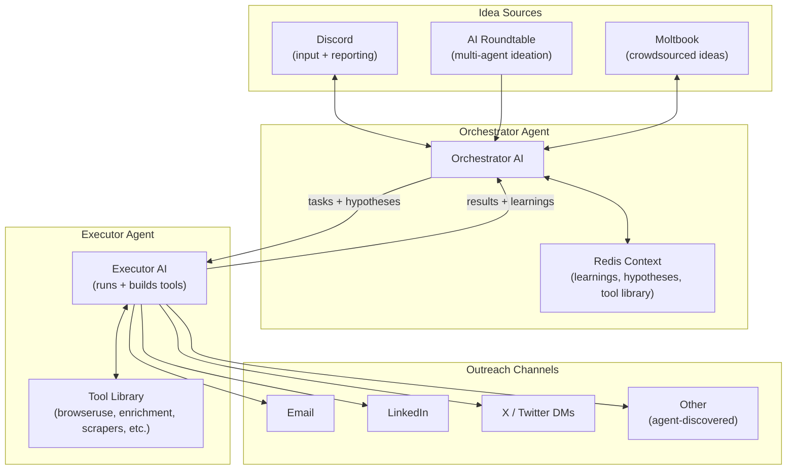
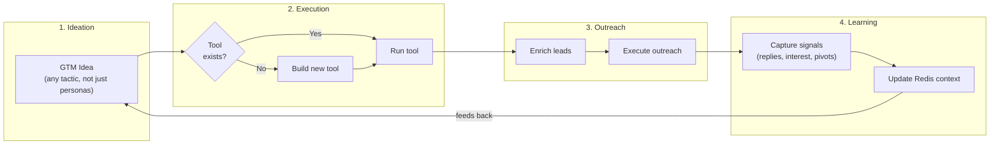

# Fullsend

> An autonomous, self-improving Go-To-Market agent that continuously generates GTM ideas, builds tools to execute them, runs outreach, and learns what works. The longer it runs, the smarter it gets.

**Fullsend** commits fully to every hypothesis. No hesitation, no half-measures. It ships ideas continuously, learns from what happens, and gets smarter over time.

## The Core Idea

Traditional GTM tools are **stateless** - you run campaigns, get results, but the tool forgets. You manually analyze what worked.

This agent is different:
- **Generates creative GTM ideas** (not just personas - tactics, channels, unconventional approaches)
- **Builds its own tools** when something doesn't exist
- **Learns from results** and feeds learnings back into idea generation
- **Runs continuously** in "YOLO mode" - always working on behalf of the customer

It's not an outreach optimizer. It's a **GTM idea machine** that compounds knowledge over time.

---

## What Makes This Novel

1. **The agent writes its own playbook** - it doesn't follow a GTM strategy, it *discovers* one through autonomous exploration

2. **Self-building toolchain** - most agents use fixed tools; this one builds new tools when it hits dead ends

3. **Compound GTM intelligence** - the longer it runs, the smarter it gets; accumulated learnings feed back into ideation

4. **Creative hypothesis generation** - ideas aren't just "target persona X", they're things like:
   - "Sponsor that hackathon next month"
   - "Scrape attendees from last week's AI conference"
   - "Find people complaining about [problem] on Reddit"
   - "Cold DM people who starred competitor's GitHub repo"
   - "Billboard on the 101"

---

## High-Level Architecture



---

## The Creative Learning Loop



---

## Component Responsibilities

### Orchestrator Agent
- Listens to idea sources (Discord, Roundtable, Moltbook)
- Maintains Redis context (the "brain" - all learnings live here)
- Generates and prioritizes GTM hypotheses
- Triggers executor with tasks
- Reports status back to Discord (can use lighter LLM for this)
- Decides when to pivot, double down, or abandon a hypothesis

### Redis Context (The Brain)
Stores:
- **Hypotheses tested** - what worked, what didn't, why
- **Tool library** - built-in tools + agent-created tools
- **Sector/product learnings** - "for fintech, CFOs respond to compliance angles"
- **Outreach patterns** - templates, timing, channels that got responses
- **Active experiments** - what's currently being tested

### Executor Agent
- Receives tasks from orchestrator
- Runs existing tools (browseruse, enrichment APIs, scrapers)
- **Builds new tools** when needed (this is the key differentiator)
- Executes outreach across channels
- Reports results back to orchestrator
- Operates like OpenClaw - tool-running in a loop

### Idea Sources

**Discord (bi-directional)**
- Input: Catches ideas from channels, responds to tags/commands
- Output: Reports status, progress, interesting findings (if reporting ON)
- Same endpoint can power a web dashboard

**AI Roundtable**
- Multiple agents discuss ideas and generate new concepts
- Seeded with current learnings from Redis context
- Produces novel hypotheses through agent debate

**Moltbook (OpenClaw social)**
- Crowdsources ideas from broader community
- Can post questions, gather responses
- Human-in-the-loop ideation at scale

---

## Example Flow

```
1. Discord user: "What about targeting people who attended AI DevTools Summit?"

2. Orchestrator:
   - Logs hypothesis to Redis
   - Checks: do we have a tool for event attendee scraping?
   - No → tasks executor to build one

3. Executor:
   - Builds LinkedIn event scraper tool
   - Runs it, gets 200 names
   - Adds tool to library for future use
   - Enriches leads (email, company, role)
   - Executes outreach

4. Results come back:
   - 15% response rate (high!)
   - 3 replies mention they're also interested in [adjacent thing]

5. Orchestrator learns:
   - Writes to Redis: "Event attendee mining: high signal"
   - Writes to Redis: "Adjacent opportunity: [thing] mentioned 3x"
   - Reports to Discord: "AI DevTools Summit attendees showing strong response. Also noticing interest in [adjacent thing]."

6. Next ideation cycle:
   - Roundtable gets seeded with "event mining works well"
   - New hypothesis emerges: "What other AI events happened recently?"
   - Loop continues, knowledge compounds
```

---

## What Success Looks Like

**For the hackathon:**
- Demo the full loop: idea → tool building → outreach → learning
- Show before/after of the Redis context (empty → rich with learnings)
- Live system running, generating ideas, reporting to Discord

**Long-term:**
- Customer sets it up, walks away
- Agent continuously works on their behalf
- Pipeline never empty
- GTM strategy emerges from data, not guesswork
- System gets smarter every week

---

## Open Questions (Future Scope)

- How to handle different feedback cycles across channels (email is slow, X is fast)?
- How to measure success of "unmeasurable" ideas (billboards)?
- How to balance exploration (new ideas) vs. exploitation (what's working)?
- How to prevent the agent from going too far off-strategy?
- Multi-tenant: can one system serve multiple customers with isolated contexts?

---

## Modular Architecture

Each component is a **standalone module/mini-service** that can be built and tested independently. This allows multiple people to work in parallel during the hackathon.

```
fullsend/
├── services/
│   ├── discord/          # Discord bot - input/output interface
│   ├── orchestrator/     # Main brain - coordinates everything
│   ├── executor/         # Runs and builds tools
│   ├── roundtable/       # Multi-agent ideation
│   ├── moltbook/         # Moltbook integration
│   └── context/          # Redis context management
├── tools/
│   ├── browseruse/       # Web browsing/scraping
│   ├── enrichment/       # Lead enrichment
│   └── ... /             # Agent-built tools go here
└── shared/
    └── types/            # Shared data structures
```

**Module contract:**
- Each service exposes a clear interface (functions or API endpoints)
- Services communicate via Redis pub/sub or direct calls
- Each can be run/tested standalone
- New services can be added without touching others

**Building a new module:**
1. Create folder under `services/` or `tools/`
2. Define its interface (what it receives, what it outputs)
3. Implement and test independently
4. Wire it up to the orchestrator

---

## Tech Stack (Rough)

- **Orchestrator**: Claude/OpenAI with tool use, long-running process
- **Executor**: OpenClaw-style tool runner OR Claude Code in YOLO mode
- **Context**: Redis (structured learnings, vector search for retrieval?)
- **Discord**: discord.py or similar
- **Tool building**: Agent writes Python scripts, validates, adds to library
- **Outreach**: Existing APIs (email services, LinkedIn automation, etc.)

---

*This document is the north star. Implementation details will evolve, but the core loop remains: generate ideas → build tools → execute → learn → repeat.*
